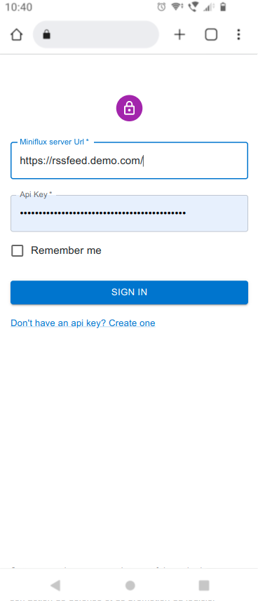
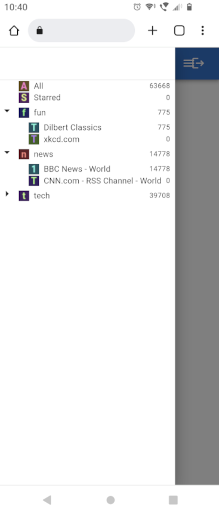
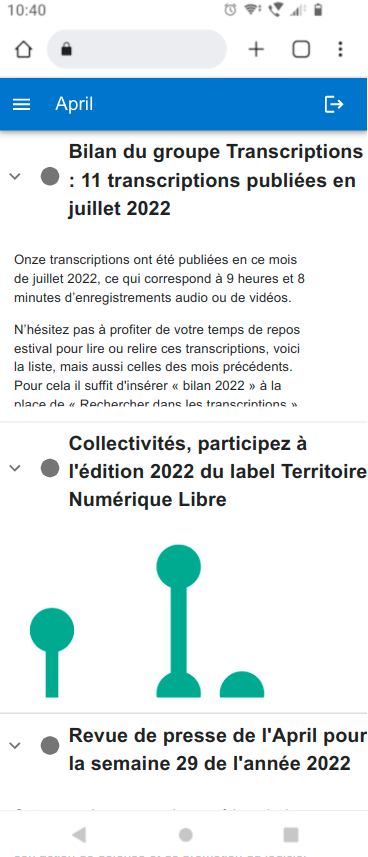
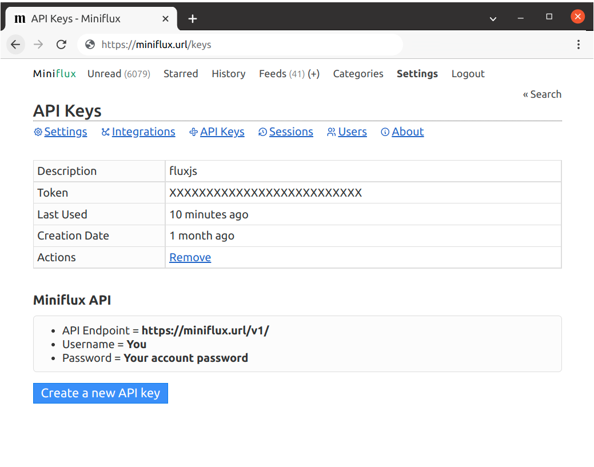

## Overview

Responsive theme for [miniflux](https://github.com/miniflux/miniflux)


## Features

- login to your miniflux account
- browse feed in left menu
- responsive design (mobile, desktop)
- infinite scroll feeds
- performance to handle hunderds+ of rss feeds

## Screenshot

Demo : https://pascalnoisette.github.io/fluxjs

|Login|Left menu|Browse|
|---|---|---|
||||


## Prepare your miniflux credential

If your miniflux homepage is https://miniflux.url/ you should generate an api key at https://miniflux.url/keys . You can connect to fluxjs with the url https://miniflux.url/ and the key. 




## Try with docker

```
docker run --rm -p 3000:80 netpascal0123/fluxjs
```

Open http://127.0.0.1:3000/fluxjs/ with your browser.

## Contribute

This is a [Next.js](https://nextjs.org/) project bootstrapped with [`create-next-app`](https://github.com/vercel/next.js/tree/canary/packages/create-next-app).

First, run the development server:

```bash
yarn dev
```
Open [http://localhost:3000](http://localhost:3000) with your browser to see the result.

Check code quality and production build :

```bash
yarn build
yarn start
```

## Release Build

The github workflow  [```ci```](https://github.com/PascalNoisette/fluxjs/blob/main/.github/workflows/ci.yml) trigger production build when something changes on the main branch. The result of the next.js build is a static page which is automatically pushed on the branch ```gh-pages```.

On the github platform, content commited to gh-pages is by convention available at https://pascalnoisette.github.io/fluxjs.

There is also a Dockerfile waiting on this branch [gh-pages](https://github.com/PascalNoisette/fluxjs/blob/gh-pages/Dockerfile) and a github workflow to build and release [the application on the Docker Hub](https://hub.docker.com/r/netpascal0123/fluxjs) with the updated version of the static page.

## Attribution & Licence

This frontend is licensed under GPL 3.0.
This frontend is a refactoring of the original work of [Reminiflux](https://github.com/reminiflux/reminiflux).
This frontend is a static page that rely entierly on the [miniflux](https://github.com/miniflux/miniflux) backend.
